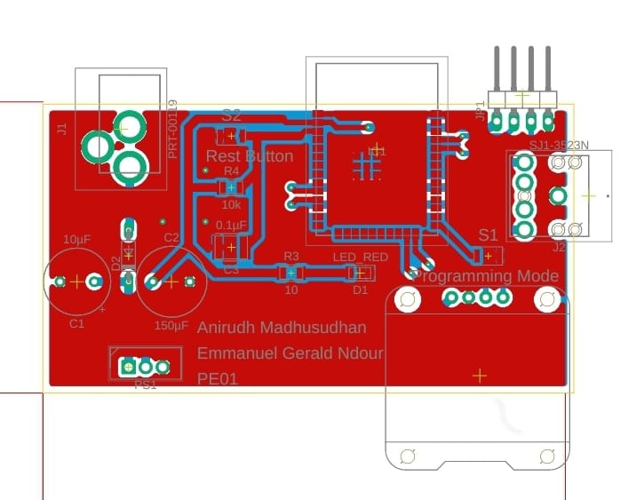
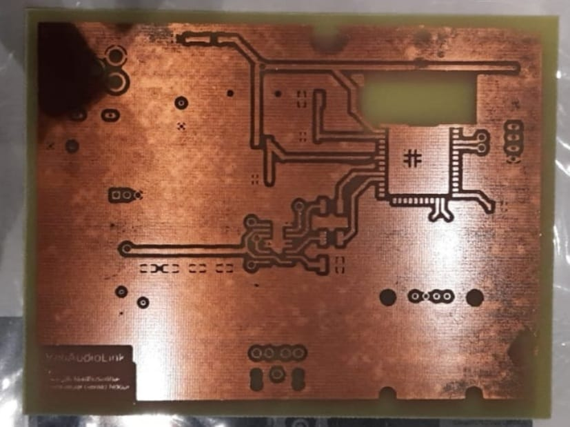
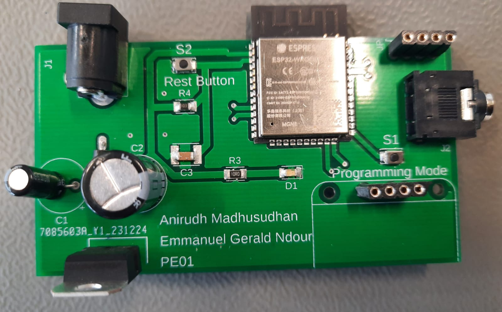

# WiFiAudioLink

by: *Anirudh Madhusudhan, Emmanuel Gerald Ndour*

**Faculty of Technology and Bionics**

***Rhine-Waal University of Applied Sciences***

Date: 12.01.2024


## Abstract

With a dash of DIY (Do It Yourself) spirit and a sprinkle of ingenuity, we embarked on a mission: to bridge the gap between our vintage audio companions and the vast world of the internet. With this project, we developped a pcb that enables the transformation of wired Speakers and even headhones into wireless ones. We can listen to our music or podcast through our phones or computers with bluetooth on devices that initially couldn't do it. To do this we used the technology of the ESP32 microcontroller. It became our secret weapon, breathing new life into our faithful old speakers. The magic happened on a custom-made PCB, where wires, circuits and programming wove a symphony of connectivity.

This project isn't just about wires and circuits, though. It's about preserving the soul of these speakers, letting them dance to the beat of the digital age. It proves that innovation doesn't require a hefty budget but just creativity and a dash of determination. It also protects the environment as we will be less tempted to throw away our old wired speakers that we might consider as outdated. We want to share this journey with you, in the hopes that it sparks a fire in others to embark on their own adventures in tech transformation.

So, welcome to our world of resurrected speakers, where the past meets the future, and where old melodies find new life. Together, let's turn forgotten relics into vibrant voices in the modern chorus of life.


Table of Contents
=================

* [WiFiAudioLink](#wifiaudiolink)
   * [Abstract](#abstract)
   * [Table of Contents](#table-of-contents)
   * [1  Introduction](#1--introduction)
      * [1.1 Background:](#11-background)
      * [1.2 Presentation of chapters:](#12-presentation-of-chapters)
   * [2 Bill Of Materials](#2-bill-of-materials)
   * [3 Theory:](#3-theory)
   * [4  Schematic design and additional visuals:](#4--schematic-design-and-additional-visuals)
      * [4.1 Schematic design:](#41-schematic-design)
      * [4.2 Additional Visuals:](#42-additional-visuals)
   * [5 Power Requirements:](#5-power-requirements)
   * [6 Hardware and Software Description](#6-hardware-and-software-description)
      * [6.1 Hardware description:](#61-hardware-description)
      * [6.1.1 ESP32-WROOM-32E:](#611-esp32-wroom-32e)
      * [6.1.2 LM1084IT-3.3 Voltage regulator:](#612-lm1084it-33-voltage-regulator)
      * [6.1.3 Audio Jack Connector:](#613-audio-jack-connector)
      * [6.1.4 OLED Screen:](#614-oled-screen)
      * [6.1.5 PCB as Capacitor:](#615-pcb-as-capacitor)
      * [6.2 Software descripton:](#62-software-descripton)
   * [7 Assembly Process:](#7-assembly-process)
   * [8 Testing](#8-testing)
   * [9 Challenges:](#9-challenges)
      * [10 Results](#10-results)
      * [11 Discussion](#11-discussion)
   * [12 Improvements and future upgrades:](#12-improvements-and-future-upgrades)
   * [13	Concluding Comments](#13concluding-comments)
   * [14 References](#14-references)


## 1  Introduction
### 1.1 Background:
As students our pockets don't run deep, and the siren call of those sleek, internet-connected speakers feels like a distant dream. So, what's the solution? We turn to what we have: a collection of old, cherished speakers that have seen better days. They might not be the shiniest or the latest, but they hold a special place in our hearts. That's the reason why we decided to make this PCB.

### 1.2 Presentation of chapters:
In our report, we systematically outline the progression from the initial project concept to its actual implementation. Chapter 2 provides an overview of the primary components incorporated into our Printed Circuit Board (PCB). Subsequently, Chapter 3 delves into the interconnections among these components. The schematic design is detailed in Chapter 4, while Chapter 5 is dedicated to the computation of power requirements. In Chapter 6, both hardware and software implementations are thoroughly described. Following this, Chapter 7 elucidates the assembly process of the PCB. The subsequent chapter is dedicated to the testing procedures conducted on the PCB. Chapter 9 addresses the challenges encountered during the project, and Chapter 10 offers a presentation of the results. We discussed those results in chapter 11. Future improvements and potential upgrades are explored in Chapter 12. Concluding remarks and references are respectively covered in Chapters 13 and 14. This structured approach allows for a comprehensive exploration of each phase in the development and realization of the project.


## 2 Bill Of Materials

We used the following components during our project
|Components|Quantity|Price in euros|
|---------|--------|-------|
|ESP32-WROOM-32E| 1 | 2.67 |
|Audio Jack Connector| 1 | 1.49 |
|10 Microfarad Capacitor| 1 | 0.75 |
|150 Microfarad Capacitor| 1 | 0.80 |
|LM1084IT-3.3 voltage regulator| 1 | 2.63 |
|OLED Screen| 1 | 7.79 |
|Red LED| 1 | 0.09 |
|Switch | 2 | 0.71 |
|DC Barrel Power Connector| 1 | 1.20 | 

## 3 Theory:
The wireless speaker conversion PCB is carefully crafted to seamlessly integrate various components for optimal functionality. At the heart of the design lies the ESP32-WROOM-32E, a powerful and versatile microcontroller that serves as the core processing unit. A voltage regulator ensures stable power supply to the system, maintaining consistent performance. The inclusion of a power jack connector facilitates easy power input, while an audio jack connector seamlessly interfaces with the wired speaker. Two capacitors are strategically placed for smoothing and filtering purposes, contributing to improved signal integrity. The integration of an OLED screen provides a user-friendly interface for monitoring and configuring the wireless speaker system. To indicate the operational status, a red LED is incorporated, visually signaling when the PCB is powered.

## 4  Schematic design and additional visuals:

### 4.1 Schematic design:


### 4.2 Additional Visuals: 





## 5 Power Requirements:

1. ESP-32: 
```math
P_{esp} = 3.3V \cdot 379mA = 1.25W
```
> the current 379mA is directly from the datasheet as the peak current when using the Wifi RF module at 19.5 dBm

2. Low dropout voltage regulator: 
```math
P_{reg} = (V_{in} - V_{out}) \cdot I_{L} 
```
> The power supply we are using is running at 6V but any power supply above 3.5V should work to power the circuit. Low the input voltage lower the power requirement
```math
P_{reg} = (6V - 3.3V) \cdot 379mA 
```
```math
{P_{reg} = 1.02W}
```
**Total Power Requirement**
```math
P_{total} = P_{esp} + P_{reg} = 1.25W + 1.02W 
\\


```
```math
P_{total} = 2.27W
```

## 6 Hardware and Software Description

### 6.1 Hardware description:

### 6.1.1 ESP32-WROOM-32E:
The ESP32-WROOM-32E is a highly integrated and powerful Wi-Fi and Bluetooth dual-mode module based on the ESP32 chip. This compact module features a dual-core Xtensa LX6 microprocessor, running at up to 240MHz, with abundant memory resources including 520KB of internal SRAM and 4MB of flash memory. It supports 802.11 b/g/n Wi-Fi and Bluetooth 4.2 connectivity, making it suitable for a wide range of IoT applications. The module also includes a rich set of peripheral interfaces, such as SPI, I2C, UART, PWM, and GPIO, providing flexibility for various sensor and peripheral connections. With its low power consumption and advanced features, the ESP32-WROOM-32E is well-suited for applications requiring wireless communication and efficient processing in a compact form factor.

### 6.1.2 LM1084IT-3.3 Voltage regulator:
The LM1084IT-3.3 is a low dropout voltage regulator designed for providing a stable output voltage of 3.3 volts with a maximum dropout voltage of 1.5 volts. This linear regulator is part of the LM1084 series and features a TO-220 package for efficient heat dissipation. With a maximum output current of 5 amps, it is capable of powering a variety of electronic devices. The LM1084IT-3.3 incorporates thermal shutdown and current limit protection mechanisms to enhance reliability. It operates over a wide input voltage range and maintains a high level of accuracy and regulation, making it suitable for applications where a stable and precise 3.3-volt power supply is required, such as in embedded systems, microcontrollers, and other electronic circuits.

### 6.1.3 Audio Jack Connector:
The audio jack connector is a standardized hardware interface widely used for transmitting analog audio signals between electronic devices. Typically found in audio equipment such as headphones, speakers, and mobile devices, the connector consists of a 3.5mm or 1/8-inch cylindrical plug with a metal tip, ring, and sleeve configuration. The tip carries the left audio channel, the ring often carries the right audio channel, and the sleeve is the common ground. The connector may also support additional features like microphone input. Audio jacks provide a simple and reliable method for connecting audio devices, allowing for the seamless playback of audio content across various platforms and devices, making them a ubiquitous component in consumer electronics.

### 6.1.4 OLED Screen:
The OLED (Organic Light Emitting Diode) screen is a display technology that utilizes organic compounds to emit light when an electric current is applied. OLED screens are characterized by their self-emitting pixels, allowing for high contrast ratios, vibrant colors, and faster response times compared to traditional display technologies. The screen typically consists of multiple layers, including a substrate, organic layers, and a transparent electrode. OLEDs are known for their flexibility, enabling the creation of curved or flexible displays. They are widely used in various electronic devices, including smartphones, televisions, and wearables, due to their ability to deliver crisp images with deep blacks and energy efficiency. Additionally, OLED screens can be manufactured in different sizes, making them suitable for diverse applications and form factors.

### 6.1.5 PCB as Capacitor:
We tried to use the two layers of copper of the PCB separated by a isolation layer to use as a DC-blocking capacitor. Using the dimenstion of the final PCB, we later on added a capacitor to the schematic.

**Theoretical Capacitance**

```math

C = \frac{\epsilon_r \epsilon_oA}{d}
=>
C = \frac{4.7 \cdot  8.85 \cdot 10^{-12} Fm^{-1} \cdot 43.18mm \cdot 77.47mm }{1.6mm}

\\
C = 87.2pF
```

**Measured Capacitance**

```math

C = 8pF
```


### 6.2 Software descripton:


**Bluetooth Class**


```cpp:

class BluetoothA2DPCommon {
    public:
        /// Destructor
        virtual ~BluetoothA2DPCommon() = default;
    
        /// activate / deactivate the automatic reconnection to the last address (per default this is on)
        void set_auto_reconnect(bool active);

        /// Closes the connection
        virtual void disconnect();

        /// Reconnects to the last device
        virtual bool reconnect();

        /// Connnects to the indicated address
        virtual bool connect_to(esp_bd_addr_t peer);

        /// Calls disconnect or reconnect
        virtual void set_connected(bool active);

        /// Closes the connection and stops A2DP
        virtual void end(bool releaseMemory=false);

        /// Checks if A2DP is connected
        virtual  bool is_connected() = 0;

        /// Sets the volume (range 0 - 255)
        virtual void set_volume(uint8_t volume){
            ESP_LOGI(BT_AV_TAG, "set_volume: %d", volume);
            volume_value = volume;
            volume_control()->set_volume(volume);
            volume_control()->set_enabled(true);
            is_volume_used = true;
        }
            
        /// Determines the actual volume
        virtual int get_volume(){
            return is_volume_used ? volume_value : 0;
        }

        /// you can define a custom VolumeControl implementation
        virtual void set_volume_control(A2DPVolumeControl *ptr){
            volume_control_ptr = ptr;
        }

        /// Determine the actual audio state
        virtual esp_a2d_audio_state_t get_audio_state();
    
        /// Determine the connection state
        virtual esp_a2d_connection_state_t get_connection_state();

        /// Set the callback that is called when the connection state is changed
        /// This callback is called before the I2S bus is changed.
        virtual void set_on_connection_state_changed(void (*callBack)(esp_a2d_connection_state_t state, void *), void *obj=nullptr);

        /// Set the callback that is called after the audio state has changed.
        /// This callback is called after the I2S bus has changed.
        virtual void set_on_audio_state_changed_post(void (*callBack)(esp_a2d_audio_state_t state, void*), void* obj=nullptr);

        /// Set the callback that is called when the audio state is changed
        virtual void set_on_audio_state_changed(void (*callBack)(esp_a2d_audio_state_t state, void*), void* obj=nullptr);

       /// Prevents that the same method is executed multiple times within the indicated time limit
        virtual void debounce(void(*cb)(void),int ms);

        /// Logs the free heap
        void log_free_heap();

        /// converts esp_a2d_connection_state_t to a string
        const char* to_str(esp_a2d_connection_state_t state);

        /// converts a esp_a2d_audio_state_t to a string
        const char* to_str(esp_a2d_audio_state_t state);

        /// converts a esp_bd_addr_t to a string - the string is 18 characters long! 
        const char* to_str(esp_bd_addr_t bda);

#if ESP_IDF_VERSION >= ESP_IDF_VERSION_VAL(4, 0, 0)
        /// converts esp_avrc_playback_stat_t to a string
        const char* to_str(esp_avrc_playback_stat_t state);
#endif

        /// defines the task priority (the default value is configMAX_PRIORITIES - 10)
        void set_task_priority(UBaseType_t priority){
            task_priority = priority;
        }


        /// Defines the core which is used to start the tasks (to process the events and audio queue)
        void set_task_core(BaseType_t core){
            task_core = core;
        }

        /// Defines the queue size of the event task 
        void set_event_queue_size(int size){
            event_queue_size = size;
        }

        /// Defines the stack size of the event task (in bytes)
        void set_event_stack_size(int size){
            event_stack_size = size;
        }

        /// Provides the address of the last device
        virtual esp_bd_addr_t* get_last_peer_address() {
            return &last_connection;
        }

#if ESP_IDF_VERSION >= ESP_IDF_VERSION_VAL(4, 0, 0)
    /// Bluetooth discoverability
    virtual void set_discoverability(esp_bt_discovery_mode_t d);
#endif

    /// Bluetooth connectable
    virtual void set_connectable(bool connectable) {
        set_scan_mode_connectable(connectable);
    }

    /// Provides the actual SSID name
    virtual const char* get_name() {
        return bt_name;
    }

    /// clean last connection (delete)
    virtual void clean_last_connection();

    protected:
        const char* bt_name = {0};
        esp_bd_addr_t peer_bd_addr;
        ReconnectStatus reconnect_status = NoReconnect;
        unsigned long reconnect_timout=0;
        unsigned int default_reconnect_timout=10000;
        bool is_autoreconnect_allowed = false; 
        uint32_t debounce_ms = 0;
        A2DPDefaultVolumeControl default_volume_control;
        A2DPVolumeControl *volume_control_ptr = nullptr;
        esp_bd_addr_t last_connection = {0,0,0,0,0,0};
        bool is_start_disabled = false;
        void (*connection_state_callback)(esp_a2d_connection_state_t state, void* obj) = nullptr;
        void (*audio_state_callback)(esp_a2d_audio_state_t state, void* obj) = nullptr;
        void (*audio_state_callback_post)(esp_a2d_audio_state_t state, void* obj) = nullptr;
        void *connection_state_obj = nullptr;
        void *audio_state_obj = nullptr;
        void *audio_state_obj_post = nullptr;
        const char *m_a2d_conn_state_str[4] = {"Disconnected", "Connecting", "Connected", "Disconnecting"};
        const char *m_a2d_audio_state_str[3] = {"Suspended", "Stopped", "Started"};
        const char *m_avrc_playback_state_str[5] = {"stopped", "playing", "paused", "forward seek", "reverse seek"};
        esp_a2d_audio_state_t audio_state = ESP_A2D_AUDIO_STATE_STOPPED;
        esp_a2d_connection_state_t connection_state = ESP_A2D_CONNECTION_STATE_DISCONNECTED;
        UBaseType_t task_priority = configMAX_PRIORITIES - 10;
        // volume 
        uint8_t volume_value = 0;
        bool is_volume_used = false;
        BaseType_t task_core = 1;

        int event_queue_size = 20;
        int event_stack_size = 3072;


#if ESP_IDF_VERSION >= ESP_IDF_VERSION_VAL(4, 0, 0)
        esp_bt_discovery_mode_t discoverability = ESP_BT_GENERAL_DISCOVERABLE;
#endif

        virtual esp_err_t esp_a2d_connect(esp_bd_addr_t peer) = 0;
        virtual const char* last_bda_nvs_name() = 0;
        virtual void get_last_connection();
        virtual void set_last_connection(esp_bd_addr_t bda);
        virtual bool has_last_connection();
        // change the scan mode
        virtual void set_scan_mode_connectable(bool connectable);
        virtual void set_scan_mode_connectable_default() = 0;

        /// provides access to the VolumeControl object
        virtual A2DPVolumeControl* volume_control() {
            return volume_control_ptr !=nullptr ? volume_control_ptr : &default_volume_control;
        }
};
```

**I2S configuration structure**

```cpp:

static const i2s_config_t i2s_config = {
    .mode = (i2s_mode_t) (I2S_MODE_MASTER | I2S_MODE_TX | I2S_MODE_DAC_BUILT_IN),
    .sample_rate = 44100, // corrected by info from bluetooth
    .bits_per_sample = (i2s_bits_per_sample_t) 16, /* the DAC module will only take the 8bits from MSB */
    .channel_format = I2S_CHANNEL_FMT_RIGHT_LEFT,
    .communication_format = (i2s_comm_format_t)I2S_COMM_FORMAT_STAND_MSB,
    .intr_alloc_flags = 0, // default interrupt priority
    .dma_buf_count = 8,
    .dma_buf_len = 64,
    .use_apll = false
};

```

## 7 Assembly Process:
In order to complete our project, the opportunity was given to us in the lab to use several machines and tools. We will list them and explain how they helped us achieve our goals.

-**Solder Paste Stencil**:
The primary function of the solder paste stencil is to facilitate the precise application of solder paste onto the pads of a PCB.
We carefully used the solder paste before the placement of the SMD components. After using the Solder Paste Stencil, we now had to place the SMD components with the help of the Pick and Place machine.


-**Pick and Place machine**:
This machine helped us place our SMD components. The machine is organized in such a way that we can pick the SMD components. Different kinds of SMD components were already available. The machine sucks up the components and with the help of the screen we can place the SMD components with high precision. Despite the machine successfully picking up most of the components, it was impossible for it to pick our ESP32-WROOM-32E. This was a big challenge for us as we were left with two options: Either place the ESP with our hand on the solder paste or solder it with Soldering Iron. We choosed the first option but not without any problem as our hands were moving a lot and we failed several times to placed it at the right place. At each failed attempt to place it, we had to clean the solder paste and try again. After placing the components, it was now time to solder them.


-**Soldering Reflow Oven**:
The Soldering Reflow Oven was a crucial tool in our surface mount design assembly. It followed a precise temperature profile which involved multiple stages. Preheat: Gradually raising the temperature to remove any residual solvents from the solder paste. Soak: Holding the temperature at a specific level to allow the solder paste to fully liquefy and wet the component leads and PCB pads. Reflow: Rapidly heating to the peak temperature, causing the solder to melt and form the solder joints. Cooling: Gradually lowering the temperature to solidify the solder joints. The Soldering Reflow Oven has a screen that showed us the temperature and the time left. With this machine, we successfully soldered the SMD components. However all our components were not SMD ones as we also had some through hole components to solder and to do it we used the soldering iron.


-**Soldering Iron**: 
A soldering iron is a handheld tool with a metal tip that heats up for the purpose of melting solder, a metal alloy with a low melting point. The primary function of the soldering iron was to solder electronic components on a printed circuit board (PCB). We used it to solder our voltage regulator, our capacitor, our audio jack connector and the Power Jack/Connector.


## 8 Testing
Once all components were soldered onto the PCB for the wireless speaker conversion, a meticulous testing process was initiated to ensure the integrity of the connections and the overall functionality of the device. The first step involved a thorough examination using a multimeter, focusing on both ground and power connections. This comprehensive check aimed to identify any potential shorts or irregularities that could compromise the performance of the wireless speaker system. Following the multimeter tests, an oscilloscope was employed to delve deeper into the electrical characteristics. Specifically, the oscilloscope was used to inspect waveforms and calculate noise levels, crucial considerations given the nature of audio processing. This step was essential to gauge the extent of any unwanted electrical interference or noise within the system, ensuring that the converted wireless speakers would deliver clear and high-quality audio output. The oscilloscope's precision allowed for a detailed analysis of the electrical signals, enabling the identification and rectification of any anomalies before finalizing the wireless transformation of the speakers.

## 9 Challenges:
It is important to point the fact that we didn't get our PCB working at the first try. Our success was preceded by some challenges and disappointments. In our first try we printed and etched the PCB in the lab. However the two sides of our PCB weren't perfectly aligned and the cooper started disappearing. This could have resulted in the PCB not achieving it's purpose. 



We therefore decided to order the PCB to avoid the two problems we were faced. We soldered the components on the ordered PCB and tested it. Again, we didn't get the expected results. Our PCB was partly working because the volume was too low as the amplifier didn't fullfill it's purpose. While trying to desolder our ESP32 microcontroller, we unfortunately broke it. Another issue was that our PCB was unnecessarily too big and we could make it way smaller.


We came up with new ideas and the goal to reduce the size of our PCB and good news this time it work perfectly. 

### 10 Results
   

### 11 Discussion
We designed a new circuit. The biggest difference to the previous ones is the removal of the audio amplifier and also the efficient use of the space because our final PCB is 76% smaller than the previous version. We once again ordered the PCB and after its arrival, we started soldering again (YES! Aafter so many tries we're now experts at soldering). Once the assembly process was done, we started programming the microcontroller. We tested our PCB with headphones and Speakers. The hard work payed off and our project was fully functional. We were of course happy and proud to have succeeded a project that many people qualified as too ambitious or too complicated. 
            

## 12 Improvements and future upgrades:
In our continuous pursuit of enhancing the functionality and aesthetics of our wireless speaker conversion PCB, we envision several exciting future upgrades. First on the list is the integration of voice control capabilities, leveraging advanced technologies to enable users to effortlessly command and manipulate the speakers through vocal commands. This addition will bring a new dimension of user convenience and hands-free operation to our wireless speaker system. Additionally, we plan to incorporate a dedicated volume control feature, allowing users to easily adjust audio levels to suit their preferences. This enhancement aims to offer a more personalized and immersive audio experience. To complement the upgraded functionalities, we are also planning to design a stylish and durable housing for the PCB, ensuring not only optimal performance but also an appealing visual presence. This aesthetically pleasing enclosure will not only protect the internal components but also contribute to a polished and sophisticated final product. These forward-looking improvements will elevate our wireless speaker conversion PCB, providing users with a seamless, feature-rich, and visually pleasing audio solution.

## 13	Concluding Comments
This project had a significant importance for us as it gave us have a deeper understanding of the electronics world but we hope it will help in the effort of saving the environment as people will now think about recycling their old speakers or headphones. With this project we felt like real engineers from the research and development to the production. We saw the real applications of voltage regulators, capacitors and microcontrollers. We also gained insight about project management. 
The feedbacks we got from the tutors Jure and Thomas, Mr. Kremer, Mr. Muhs and Professor Hartanto helped us in the continuous improvement of the project. 
After long discussion we made the decision to start serial production of the PCB as many people are interested. We also want to make it cheap, as we estimated the total cost to be around 10 euros and we target the populations that can't afford to buy wireless speakers.


## 14 References

* [1] DroneBot Workshop. (2022, May 22). _ESP32 SOUND - WORKING WITH I2S_. Youtube. https://www.youtube.com/watch?v=m-MPBjScNRk
* [2] GreatScott. (2020, July 12). _Building a Digital Music Player with I2S?! What is I2S!_ . Youtube. https://www.youtube.com/watch?v=qNLvoSQCx60 
* [3] Texas instruments, "LM1084 5-A Low Dropout Positive Regulators", LM1084 datasheet, Sept. 1999 [Revised Jan. 2015]. https://www.ti.com/lit/ds/symlink/lm1084.pdf?ts=1705070693008&ref_url=https%253A%252F%252Fwww.google.com%252F
* [4] Espressif Systems, " esp32-wroom-32e datasheet ", Jan. 2023. https://www.espressif.com/sites/default/files/documentation/esp32-wroom-32e_esp32-wroom-32ue_datasheet_en.pdf 
* [5] Cspot, https://github.com/feelfreelinux/cspot


